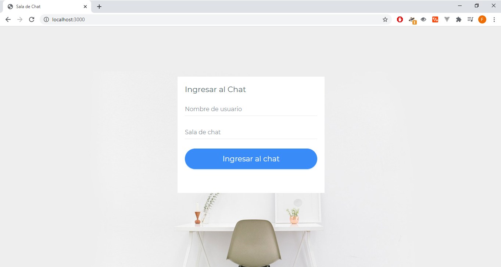
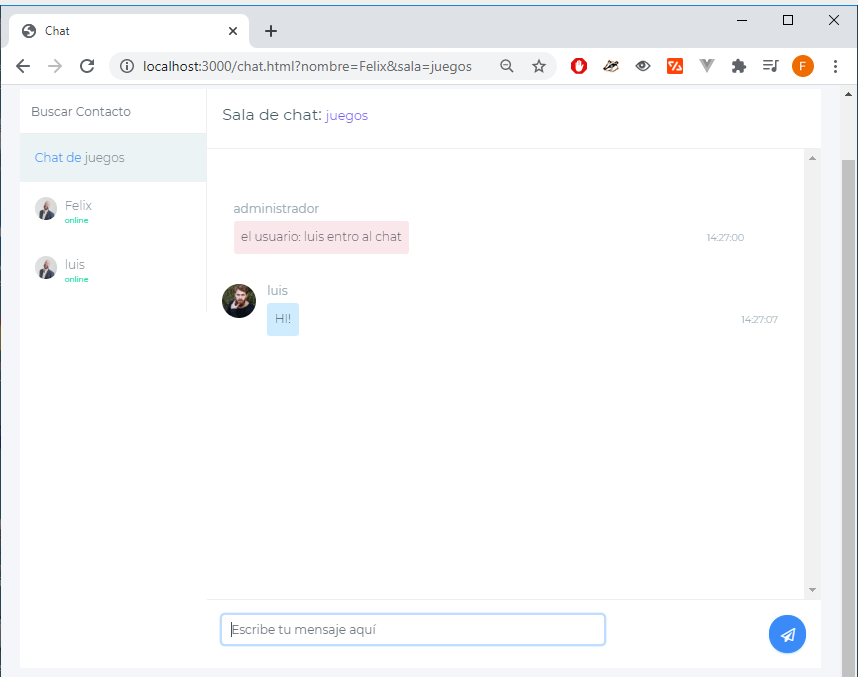

# Socket-Chat:

## Aplication and Chat Server done with Node.js, Express y Socket.io

### Welcome Screen:


### Chat Screen:



Remember to rebuild the node_modules directory with:

```
npm install
```